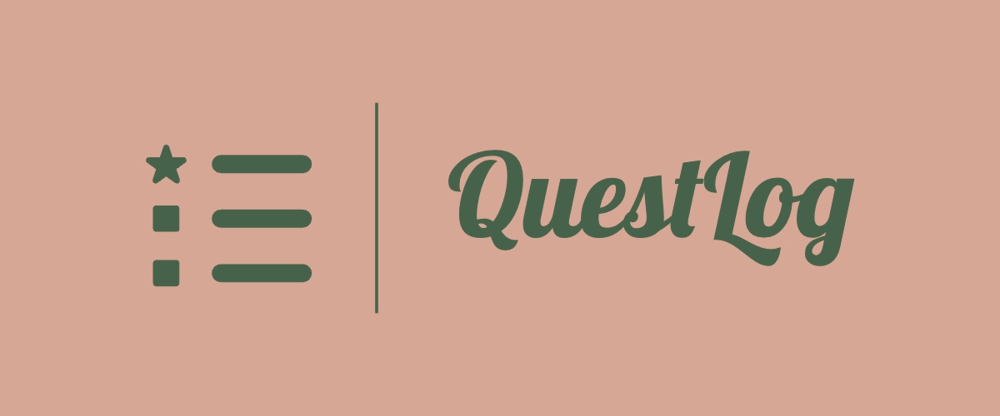

<p align="center">
  <i align="center">An adventure-themed productivity app</i> ⚔️🛡️📝
</p>

## Project Overview

### Purpose

QuestLog isn't just a to-do list; it's an adventure-themed productivity app that turns your daily tasks into exciting quests. Designed for those seeking motivation and fun in their daily routines, QuestLog combines the practicality of a to-do list with the engaging elements of a role-playing game.

Check out the live version here: [QuestLog Demo](https://kevinweejh.github.io/questlog/).

### Key Features

- [ ] Quest-Based Tasks: Each task you add is treated as a "quest" with different difficulty levels (Easy, Medium, Hard). Completing these quests earns you points and rewards.

- [ ] Character Progression: Create a character when you start using the app. Completing tasks levels up your character, unlocking new abilities and rewards.

- [ ] Reward System: Earn in-app currency, "Gold," by completing tasks. Use Gold to customize your character and unlock special abilities.

## Technical Details

### Local Storage
QuestLog stores your data using the browser's `localStorage`, ensuring it remains available even after closing the tab or window. That said, data persistence is not guaranteed in 'private browsing' mode or if your browser is set to clear data automatically. It is worth noting that the data stored in `localStorage` is specific to the domain of QuestLog, so it can't be accessed by other websites, enhancing security and privacy.

## Getting Started

These instructions will get you a copy of the project up and running on your local machine for development and testing purposes.

### Prerequisites

Node.js v21.1.0

### Installation

```bash
npm install
```

### Running the Project

#### For development:

```bash
npm start
```

#### For production:

```bash
npm run build
```

## Usage and Examples

1. **Create Your Character**: Start by creating your character.
2. **Add Your Tasks**: Enter your daily tasks as quests with their difficulty levels.
3. **Complete Quests**: Work on completing quests to earn points and Gold.
4. **Level Up**: Track your progress and watch your character grow.
5. **Compete and Share**: Connect with friends and share your journey.

## Contribution and Support

### Contributing

While this project is primarily a personal learning exercise, I welcome anyone interested in using it for their learning or experimenting. Feel free to fork the repository, try out different configurations, and share your findings. 

If you have suggestions for improvements or new features, please read [CONTRIBUTING.md](LINK_TO_CONTRIBUTING.md) for details on our code of conduct, and the process for submitting pull requests to us.

### Support

For support or to report issues, contact me at [hello@codebykevin.dev](mailto:hello@codebykevin.dev). 

## Acknowledgements and References

This project utilizes resources from [Tailwind CSS](https://tailwindcss.com/docs/installation) and [Webpack](https://webpack.js.org/guides/) documentation, [GitHub Pages Deploy Action](https://github.com/JamesIves/github-pages-deploy-action) for deployment, along with third-party plugins like [MiniCssExtractPlugin](https://webpack.js.org/plugins/mini-css-extract-plugin/), [css-minimizer-webpack-plugin](https://webpack.js.org/plugins/css-minimizer-webpack-plugin/), and [HtmlWebpackPlugin](https://webpack.js.org/plugins/html-webpack-plugin/).

## License

This project is licensed under the MIT License - see the [LICENSE.md](LICENSE.md) file for details
